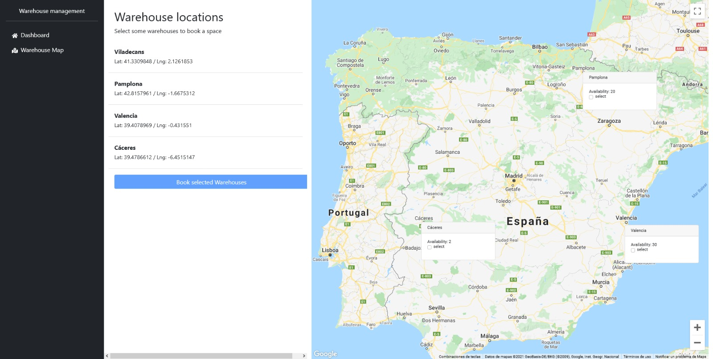
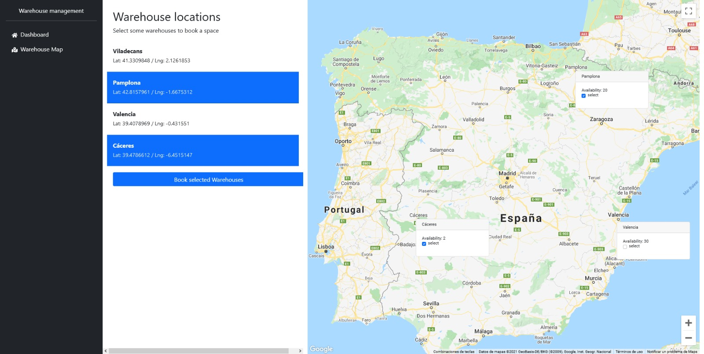
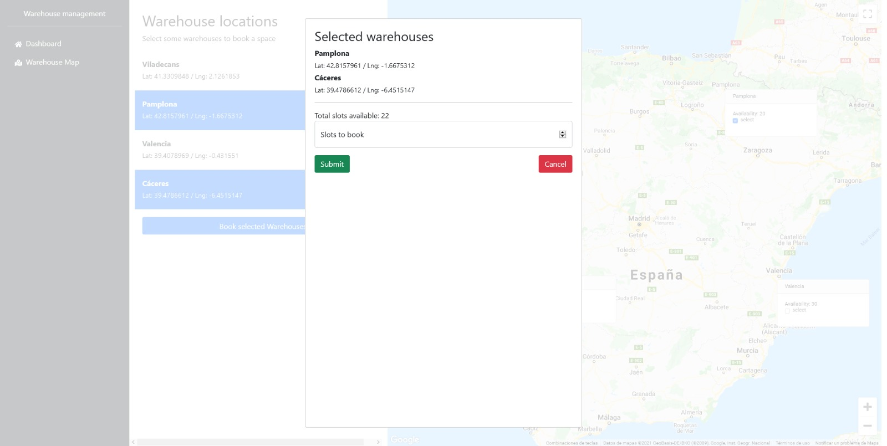

# Google Maps API test on React

This is a fast test done in 1h-2h using google-map-react.

It displays a map with some locations, then it's allowed to select some of them. After, it displays a modal with their info.

## Screenshots

